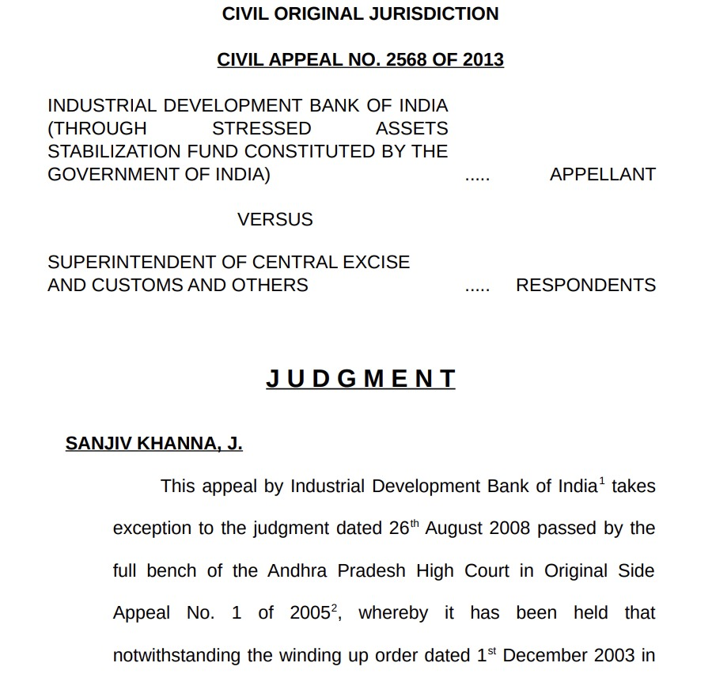
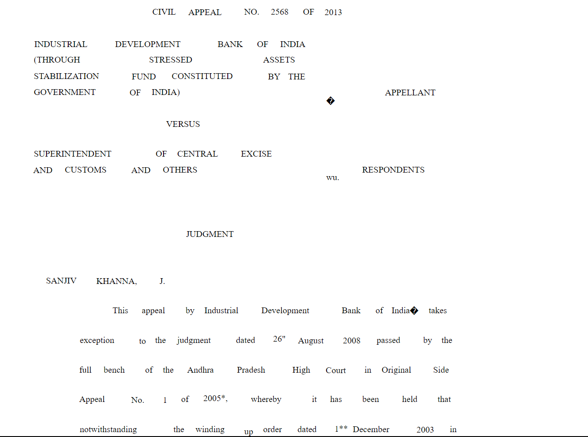

# Appproach

## Appproach 1

First, I tried various libraries of python like  PyMuPDF (flitz), pdfplumber,etc.

### Code

```python
import fitz  # PyMuPDF

def extract_pdf_text_with_formatting(pdf_path):
    pdf_document = fitz.open(pdf_path)

    extracted_text = ""

    for page_num in range(pdf_document.page_count):
        page = pdf_document.load_page(page_num)

        text_instances = page.get_text("words")  # Get text instances by words

        for word_info in text_instances:
            word_text = word_info[4]  # Extract the word text
            font_size = word_info[1]   # Font size
            font_name = word_info[6]   # Font name
            text_color = word_info[7]  # Text color

            # Format the extracted word using the font size, font name, and text color
            formatted_word = (
                f'<span style="font-size: {font_size}px; font-family: {font_name}; color: {text_color};">{word_text}</span>'
            )

            extracted_text += formatted_word + " "

        extracted_text += "<br>"  # Add line break after each page

    pdf_document.close()

    return extracted_text

pdf_path = "your_pdf_file.pdf"
extracted_text_with_formatting = extract_pdf_text_with_formatting(pdf_path)
print(extracted_text_with_formatting)


```

```python
import fitz  # PyMuPDF

def extract_pdf_text(pdf_path):
    pdf_document = fitz.open(pdf_path)

    extracted_text = ""

    for page_num in range(pdf_document.page_count):
        page = pdf_document.load_page(page_num)
        text = page.get_text("text")
        extracted_text += text + "<br>\n"  # Add HTML line break after each line

    pdf_document.close()

    return extracted_text

def save_as_html(text, html_path):
    with open(html_path, "w", encoding="utf-8") as file:
        file.write(f"<html>\n<body>\n{text}\n</body>\n</html>")

pdf_path = "your_pdf_file.pdf"
html_path = "output.html"

extracted_text = extract_pdf_text(pdf_path)
save_as_html(extracted_text, html_path)

print(f"PDF text extracted and saved as HTML in {html_path}")


```

### Problem

The problem is that it is not able to extract the font size and spacing much efficiently.

## Approach 2

I searched for models online that can do this task. I found Amazon Textract but it is a paid service.

Then, I thought of making my own model but it would require a lot of time and also training data is not available. But, we can make our own training data with 30 pdfs for example.
But I haven't tried this.

## Approach 3

I used NLP library [SpaCy](https://spacy.io/usage/) for finding heading and other such stuffs.

### Problem

It is also not able to extract text size and spaces.

## Approach 4

I also found some git repos which can do this task

* [PDFfix](https://github.com/pdfix/pdfix_sdk_example_cpp) It has various functions like [pdf_to_html](https://pdfix.net/solutions/pdf-to-html/),etc.
* [pd3f](https://github.com/pd3f/pd3f)
* [unstructured](https://github.com/Unstructured-IO/unstructured)

There are many more repos in this (https://github.com/topics/pdf-to-text) github topic.

## Approach 5

I tried computer vision for doing this task. I first converted the pdf to image (for testing, I created one pdf page to image). I then applied the canny-edge detection to get another image. Then, I used pytesseract to extract position and size of each word and then using that x,y and width, height; I created an html file to display text in the same format. I tried this on both images(real and canny-edge) to check which gives better output.

### Code

```python
import pytesseract
from pytesseract import Output
import cv2

pytesseract.pytesseract.tesseract_cmd = r'C:\Program Files\Tesseract-OCR\tesseract.exe'

# Load the image
img = cv2.imread('test.jpg')

# Perform OCR with character-level information
custom_config = r'--oem 3 --psm 6 -c preserve_interword_spaces=1 hocr'
hocr_output = pytesseract.image_to_data(img, output_type=Output.HOCR, config=custom_config)

# Create a list to store extracted text and formatting information
extracted_text = []

for i, line in enumerate(hocr_output.splitlines()):
    if 'bbox' in line and 'ocrx_word' in line:
        bbox = line.split('bbox ')[1].split(';')[0]
        x, y, w, h = map(int, bbox.split(' '))
        text = line.split('>')[1].split('<')[0]
        extracted_text.append({'text': text, 'x': x, 'y': y, 'width': w, 'height': h})

# Sort extracted text by y-coordinate for maintaining order
extracted_text.sort(key=lambda item: item['y'])

def generate_html_markup(extracted_text):
    html_markup = '<html><body>'

    for item in extracted_text:
        text = item['text']
        x, y, w, h = item['x'], item['y'], item['width'], item['height']
        span_style = f'position: absolute; left: {x}px; top: {y}px; width: {w}px; height: {h}px;'

        # Post-processing to identify bold and underlined text
        if 'bold' in text.lower():
            span_style += ' font-weight: bold;'
        if 'underline' in text.lower():
            span_style += ' text-decoration: underline;'

        span = f'<span style="{span_style}">{text}</span>'
        html_markup += span

    html_markup += '</body></html>'
    return html_markup

# Generate HTML markup
generated_markup = generate_html_markup(extracted_text)

# Save the generated markup to an HTML file
with open('formatted_text.html', 'w') as html_file:
    html_file.write(generated_markup)

```

### Generated HTML Code

[HTML File](formatted_text.html)
### Screenshots

Testing image



Output image(HTML Page)



### Main Code

```python
import pytesseract
from pytesseract import Output
import cv2
from pdf2image import convert_from_path

# Set Tesseract path
pytesseract.pytesseract.tesseract_cmd = r'C:\Program Files\Tesseract-OCR\tesseract.exe'

# Path to your PDF file
pdf_path = 'your_input.pdf'

# Convert PDF to images
images = convert_from_path(pdf_path)

# Initialize a list to store extracted text from all images
all_extracted_text = []

# Loop through each image and perform OCR
for img in images:
    # Perform OCR with character-level information
    custom_config = r'--oem 3 --psm 6 -c preserve_interword_spaces=1 hocr'
    hocr_output = pytesseract.image_to_data(img, output_type=Output.HOCR, config=custom_config)

    # Create a list to store extracted text and formatting information for the current image
    extracted_text = []

    for i, line in enumerate(hocr_output.splitlines()):
        if 'bbox' in line and 'ocrx_word' in line:
            bbox = line.split('bbox ')[1].split(';')[0]
            x, y, w, h = map(int, bbox.split(' '))
            text = line.split('>')[1].split('<')[0]
            extracted_text.append({'text': text, 'x': x, 'y': y, 'width': w, 'height': h})

    # Sort extracted text by y-coordinate for maintaining order
    extracted_text.sort(key=lambda item: item['y'])

    all_extracted_text.append(extracted_text)

# Process the extracted text or generate HTML markup for each image
for image_number, extracted_text in enumerate(all_extracted_text, start=1):
    def generate_html_markup(extracted_text):
        html_markup = '<html><body>'

        for item in extracted_text:
            text = item['text']
            x, y, w, h = item['x'], item['y'], item['width'], item['height']
            span_style = f'position: absolute; left: {x}px; top: {y}px; width: {w}px; height: {h}px;'

            # Post-processing to identify bold and underlined text
            if 'bold' in text.lower():
                span_style += ' font-weight: bold;'
            if 'underline' in text.lower():
                span_style += ' text-decoration: underline;'

            span = f'<span style="{span_style}">{text}</span>'
            html_markup += span

        html_markup += '</body></html>'
        return html_markup

    # Generate HTML markup for the current image
    generated_markup = generate_html_markup(extracted_text)

    # Save the generated markup to an HTML file for the current image
    output_html_file = f'formatted_text_{image_number}.html'
    with open(output_html_file, 'w') as html_file:
        html_file.write(generated_markup)
```


